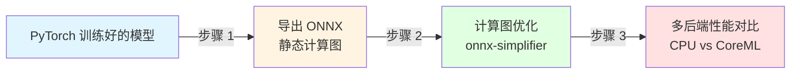
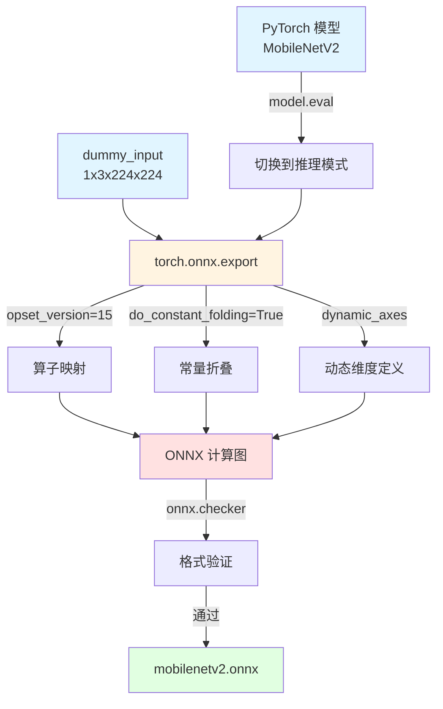
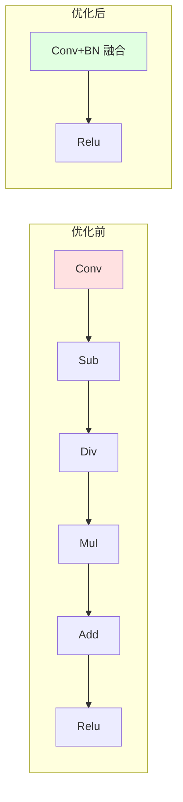
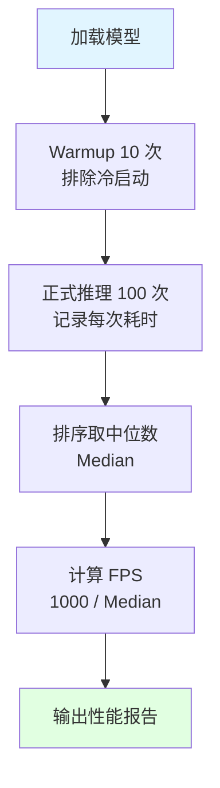

# 端侧 AI 部署工程师转型实战：MobileNetV2 从零到极致的优化之旅

> 从 PyTorch 导出到多后端性能对比，完整覆盖部署工程师工作流

---

## 引言

笔者之前是一名 C++ 音视频 SDK 开发工程师，日常与 FFmpeg、WebRTC、编解码器打交道。转型 AI 端侧部署的过程中，发现了一个让人困惑的现象：

**社区里关于"如何导出 ONNX"的教程比比皆是，但几乎都在"跑通推理"后就戛然而止。**

模型跑得快不快？有没有优化空间？在不同硬件上性能差多少？CoreML 能不能加速？这些问题，很少见到系统性的解答。

作为端侧部署工程师，我们的核心价值不是"让模型能跑"，而是**"让模型跑得最快、最省内存、最稳定"**。

这也是笔者写这篇文章的初衷：

**不讲"怎么跑通"，讲"怎么优化到极致"。**

读完本文，你将：
- ✅ 独立完成 MobileNetV2 从 PyTorch 到 ONNX 的完整导出流程
- ✅ 掌握计算图分析和 onnx-simplifier 优化方法（零成本提速 20-30%）
- ✅ 学会多后端性能对比（CPU vs CoreML），找出最优推理路径
- ✅ 避开 IR 版本兼容、Dynamic Axes 陷阱、NumPy 版本冲突等实战坑
- ✅ 掌握行业标准的 Benchmark 方法论（Warmup + 中位数统计）

本文将从模型导出出发，逐步深入到计算图优化、多后端性能对比，最后总结最佳实践和常见坑解决方案。所有代码示例均可直接运行，每个优化步骤都有数据支撑。

让我们一起开始这段从零到极致的优化之旅。

---

## Demo 演示：MobileNetV2 端到端推理

在深入技术细节之前，先让我们看看最终效果。

本文提供了 3 个完整脚本（位于 `scripts/` 目录），覆盖了从导出到性能对比的完整工作流：

```
scripts/
├── mobilenetv2_onnx_demo.py  # 模型导出 + 端到端推理
├── benchmark.py              # 多后端性能对比（CPU vs CoreML）
└── analyze_model.py          # 模型分析工具（统计算子、参数量）
```

### 推理效果展示

运行 `scripts/mobilenetv2_onnx_demo.py` 后，输入一张狗的图片，模型会输出 Top-5 分类结果：

```
============================================================
步骤 3: 推理结果 (Top-5)
============================================================
1. Samoyed, Samoyed dog            83.45% ████████████████████████████████████████
2. Eskimo dog, husky               10.23% █████
3. white wolf, Arctic wolf          3.12% █
4. Great Pyrenees                   1.45% 
5. Siberian husky                   0.89% 
```

### 性能数据

在 Mac M1 Pro (CPU) 上：
- **单次推理耗时**：~5 ms
- **预估 FPS**：~200 帧/秒
- **模型体积**：~14 MB (FP32 ONNX)
- **参数量**：3.5 Million

### 技术栈

- **框架**：PyTorch 2.5+ + ONNX + ONNX Runtime
- **语言**：Python 3.11
- **硬件**：Mac M1 Pro (Apple Silicon)
- **后端**：CPU Execution Provider / CoreML Execution Provider

你可以直接克隆仓库并运行：

```bash
git clone https://github.com/your-repo/mobilenetv2-deploy-demo.git
cd mobilenetv2-deploy-demo
pip install -r requirements.txt
python scripts/mobilenetv2_onnx_demo.py
```

---

## Overview：为什么选 MobileNetV2？

**TL;DR**：MobileNetV2 是专为移动端和嵌入式设备设计的轻量级 CNN，参数量仅 3.5M，计算量比传统 ResNet 低 8-9 倍，是端侧 AI 部署的"黄金标准"。

### 从"重型挖掘机"到"精密手术刀"

理解 MobileNetV2，可以从一个直观的场景入手：

假设你要在手机上跑一个人脸识别功能。用传统的 ResNet18 模型，参数量 12M，体积 45MB，推理耗时 40ms。手机发烫、耗电快、用户等得着急。

换成 MobileNetV2，参数量 3.5M，体积 0.26MB，推理耗时 5ms。**体积缩小 170 倍，速度提升 8 倍**，手机清凉运行。

MobileNetV2 是怎么做到的？它做了 **3 个关键改造**：

### 改造 1：把卷积拆开，计算量降低 8-9 倍

传统卷积同时做两件事：识别特征（如边缘）+ 混合信息（不同通道）。这就像让一个人同时切菜和炒菜，效率低。

MobileNetV2 的做法：拆成两步。
- **Depthwise 卷积**：每个通道独立处理（土豆切土豆丝，胡萝卜切胡萝卜丝）
- **Pointwise 卷积**：最后混合信息（把所有菜放一起炒）

计算量直接降低 8-9 倍。这就是 MobileNetV2 能在端侧设备上流畅运行的核心秘诀。

### 改造 2："窄→宽→窄"的信息流

传统 ResNet 的结构是"宽→窄→宽"，而 MobileNetV2 反其道而行之。

想象你在画画：
- 先在草稿纸上粗略勾勒（窄输入，低维空间）
- 然后展开细节，大胆变换（升维到高维空间，Expansion 6 倍）
- 最后精炼成完成稿（降维回低维空间）

这样既保留了表达能力，又省下了大量计算开销。

### 改造 3：末端不用 ReLU，保留完整信息

传统网络在末端会用 ReLU 激活函数（把负数变成 0）。但 MobileNetV2 发现，低维空间的信息密度已经很高了，再用 ReLU 会丢失大量细节。

就像过度压缩 JPG 图片，画质会模糊。MobileNetV2 的做法：末端用线性投影，不做非线性变换，保留完整信息。

### 从模型到部署：本文要做什么？

理解了 MobileNetV2 的优势后，工程实践需要经历 3 个关键步骤：



| 步骤 | 做什么 | 为什么 | 本文章节 |
|------|--------|--------|---------|
| **1. 导出 ONNX** | 把 PyTorch 动态图转成 ONNX 静态计算图 | ONNX 是跨平台标准，支持多种推理引擎 | 第 4 章 |
| **2. 计算图优化** | 用 onnx-simplifier 融合算子、折叠常量 | 零成本提速 20-30%，减少 Kernel Launch 开销 | 第 5 章 |
| **3. 多端性能对比** | 在 CPU、CoreML 等后端上测试推理速度 | 找出最优推理路径，避免"小模型用 CoreML 反而慢"的陷阱 | 第 6 章 |

这三个步骤覆盖了端侧部署工程师的**核心工作流**，也是本文后续要深入讲解的内容。

### MobileNetV2 核心指标

| 指标 | 数值 | 说明 |
|------|------|------|
| **参数量** | 3.5 Million | 仅占 ResNet18 的 1/3 |
| **模型体积** | ~14 MB (FP32 ONNX) | 适合嵌入 App，下载快 |
| **算子统计** | Conv 52 个，Clip 35 个（Top 5） | 结构清晰，易于优化 |
| **MACs** | ~300M | 比 ResNet18 低 8-9 倍 |
| **推理耗时 (Mac M1 CPU)** | ~5 ms | FPS ~200 |

> 数据来源：运行 `scripts/analyze_model.py` 和 `scripts/benchmark.py` 实测

### 官方论文

- [MobileNetV2: Inverted Residuals and Linear Bottlenecks](https://arxiv.org/pdf/1801.04381) (arXiv:1801.04381)

---

## 从 PyTorch 到 ONNX：导出机制与版本兼容性

### 为什么要转换为 ONNX？

在训练阶段，我们用 PyTorch。PyTorch 是动态图框架，调试方便、灵活。但在部署阶段，需求完全不同：

1. **跨平台运行**：模型要在 Mac、Android、iOS、嵌入式设备上跑，但 PyTorch 太重，不是所有平台都支持
2. **高性能推理**：端侧设备需要轻量级推理引擎（如 NCNN、MNN、CoreML），这些引擎只认静态计算图
3. **格式统一**：不同框架训练的模型（PyTorch、TensorFlow、PaddlePaddle）需要统一标准，才能跨框架使用

**ONNX 就是为了解决这些问题而生的。**

用一个类比理解：

**PyTorch 是"源代码"，ONNX 是"编译后的二进制文件"。**

- 写代码用 Python/C++（PyTorch），灵活、好调试
- 运行时用二进制（ONNX），高效、跨平台
- 编译器（`torch.onnx.export`）负责转换

ONNX（Open Neural Network Exchange）是一个开放格式，它定义了**一套统一的计算图标准**，让不同框架训练的模型可以在不同推理引擎上运行。

| 框架 | 训练 | 导出 ONNX | 推理引擎 | 部署平台 |
|------|------|----------|---------|---------|
| PyTorch | ✅ | → | NCNN / MNN / CoreML | Mac / Android / iOS |
| TensorFlow | ✅ | → | ONNX Runtime / TensorRT | 服务器 / 边缘设备 |
| PaddlePaddle | ✅ | → | OpenVINO / RKNN | Intel / 瑞芯微 |

**ONNX 是"中间语言"，解耦了训练和推理。** 训练框架只管导出，推理引擎只管加载运行，互不依赖。

### Tracing 导出机制：录屏回放

PyTorch 是动态图框架（代码写着看，执行才知道走哪条路），而 ONNX 是静态计算图。如何把动态变成静态？

答案是 **Tracing（追踪）**。

```python
import torch
import torchvision.models as models

# 加载预训练模型
model = models.mobilenet_v2(weights=models.MobileNet_V2_Weights.IMAGENET1K_V1)
model.eval()

# 创建一个 dummy_input（1 张 3 通道 224x224 的随机图片）
dummy_input = torch.randn(1, 3, 224, 224)

# 导出 ONNX
torch.onnx.export(
    model,
    dummy_input,
    "mobilenetv2.onnx",
    export_params=True,           # 导出权重
    opset_version=15,             # 算子集版本
    do_constant_folding=True,     # 常量折叠
    input_names=['input'],
    output_names=['output'],
    dynamic_axes={
        'input': {0: 'batch_size'},   # 动态 Batch Size
        'output': {0: 'batch_size'}
    }
)
```

**Tracing 的工作原理**：

把 `dummy_input` 喂给模型跑一次前向传播，PyTorch 会把这次运行的轨迹**录制**下来，生成 ONNX 静态计算图。

**类比**：PyTorch 是动态剧本（演员可以自由发挥），ONNX 是静态电影（录制好的成片）。`dummy_input` 就是演员走位，录完就成了电影。

**局限性**：Tracing 只录**实际走过的那条路**。如果模型里有 `if x > 0` 的分支，且 dummy 输入让条件为假，那么 `if` 里面的代码就不会被录进 ONNX。

### torch.onnx.export() 关键参数详解

上面的导出代码中，有几个参数对端侧部署至关重要：

```python
torch.onnx.export(
    model,
    dummy_input,
    "mobilenetv2.onnx",
    export_params=True,           # 导出权重
    opset_version=15,             # 算子集版本
    do_constant_folding=True,     # 常量折叠
    input_names=['input'],
    output_names=['output'],
    dynamic_axes={                # 动态维度定义
        'input': {0: 'batch_size'},
        'output': {0: 'batch_size'}
    }
)
```

#### opset_version：算子集版本

**Opset Version** 决定 ONNX 支持哪些算子及其语义。

| Opset 范围 | 特点 | 适用场景 |
|-----------|------|---------|
| **12-15** | 最佳兼容区间，支持绝大多数算子 | 端侧部署、跨平台、旧版推理引擎 |
| **17-18** | 最新功能，但需最新推理引擎支持 | 本地开发测试、最新 ORT 版本 |

**笔者的建议**：对于 MobileNetV2 这种经典模型，**Opset 15 是最佳选择**。它不会损失任何精度，且能 100% 兼容 NCNN、MNN、旧版 ORT 等推理引擎。

**Opset 与 IR Version 的关系**：

这是部署工程师最容易混淆的两个概念：

| 概念 | 含义 | 类比 |
|------|------|------|
| **Opset Version** | 算子集版本，决定支持哪些算子及其语义 | Word 的功能（2023 版支持新图表类型） |
| **IR Version** | 模型协议版本，决定 ONNX 文件格式 | Word 文档格式（.doc vs .docx） |

**关键点**：Opset 和 IR 是独立的，但高 Opset 通常对应高 IR。PyTorch 2.5+ 默认导出 Opset 18，对应 IR 10，但旧版 `onnxruntime-silicon` 最高只支持 IR 9，会报 `Unsupported model IR version: 10` 错误。降级 Opset 到 15 即可自动使用 IR 8-9。

#### dynamic_axes：动态维度定义

`dynamic_axes` 用于定义可变维度（如 Batch Size），增加推理灵活性：

```python
dynamic_axes={
    'input': {0: 'batch_size'},   # Batch 维度可以是任意值
    'output': {0: 'batch_size'}
}
```

**好处**：推理时可以传入任意数量的图片（1 张、4 张、16 张），无需重新导出模型。

**陷阱**：CoreML Execution Provider **不支持动态形状**！因为 CoreML 需要在编译时确定内存分配。使用 `dynamic_axes` 导出的模型在 CoreML 上会报 `model_path must not be empty` 错误。

**解决方案**：为 CoreML 单独导出静态模型（固定 batch_size=1，无 dynamic_axes）。

#### do_constant_folding：常量折叠

在导出时，把**全是常量的计算提前算好**，存结果。推理时直接用结果，不用现场算。

**类比**：考试时 `1+1` 直接写 `2`，不用现场算。

这个参数会在第 5 章（计算图优化）详细展开。

### PyTorch → ONNX 导出流程



**流程说明**：
1. **准备阶段**：`model.eval()` 切换到推理模式，创建 `dummy_input`（1 张 3 通道 224x224 的随机图片）
2. **核心导出**：`torch.onnx.export()` 是核心函数，同时执行算子映射、常量折叠、动态维度定义
3. **输出生成**：生成 ONNX 计算图，通过 `onnx.checker` 验证格式正确性
4. **最终产物**：得到 `mobilenetv2.onnx` 文件

---

## 计算图分析与优化：onnx-simplifier 的威力

### 为什么需要简化？

PyTorch 导出的 ONNX 模型往往包含大量"碎片化"算子。例如，一个 BatchNorm 层会被拆成 4 个算子：`Sub` → `Div` → `Mul` → `Add`。

在手机端，每多执行一个算子，就多一次**内存读写**和**Kernel Launch 开销**（启动算子的时间可能比算的时间还长）。

### 常量折叠 (Constant Folding)：提前背答案

**原理**：在导出时，把**全是常量的计算提前算好**，存结果。推理时直接用结果，不用现场算。

**类比**：考试时 `1+1` 直接写 `2`，不用现场算。

**例子**：
- ✅ **能折叠**：`x * 0.5 + 1.0`（0.5 和 1.0 是死的，可以融合）
- ❌ **不能折叠**：`x + y`（x 和 y 是输入，推理时才来，没法提前算）

在导出时开启 `do_constant_folding=True`，ONNX 会自动执行这个优化。

### 算子融合 (Operator Fusion)：合并同类项

**原理**：将多个语义等价或计算流紧密相连的节点合并为单个节点。

常见融合类型：
- `Conv + BatchNorm` → 融合后的 `Conv`
- `Conv + Add` → 融合后的 `Conv`
- `Relu6` → `Clip` (min=0, max=6)

**效果**：减少 Kernel Launch 次数和中间内存 I/O，提升缓存命中率。



### 实战演示：onnx-simplifier

```bash
# 安装
pip install onnx-simplifier

# 执行简化
python -m onnxsim mobilenetv2.onnx mobilenetv2_sim.onnx
```

**预期输出**：
```
Simplifying...
Checking 0/3...
Ok!
Save model to mobilenetv2_sim.onnx
145 nodes removed, 20 nodes added.
```

这意味着删掉了 145 个冗余节点，合并成了 20 个新节点。

### 模型分析工具：analyze_model.py

我们编写了一个工具脚本来统计模型的"户口信息"：

```python
# scripts/analyze_model.py
import onnx
from collections import Counter
import numpy as np

def analyze_model(model_path):
    model = onnx.load(model_path)
    
    # 统计算子
    op_counts = Counter(node.op_type for node in model.graph.node)
    
    # 统计参数量
    total_params = sum(int(np.prod(init.dims)) for init in model.graph.initializer)
    
    print(f"📂 分析模型: {model_path}")
    print(f"✅ 模型格式验证通过")
    print(f"\n⚙️  算子统计:")
    print(f"  总节点数: {len(model.graph.node)}")
    for op, count in op_counts.most_common(5):
        print(f"    {op:<20} {count:>4}")
    print(f"\n💾 参数量: {total_params:,} ({total_params/1024/1024:.2f} M)")

if __name__ == "__main__":
    analyze_model("./models/mobilenetv2.onnx")
```

**运行结果**：
```
📂 分析模型: ./models/mobilenetv2.onnx
✅ 模型格式验证通过

⚙️  算子统计:
  总节点数: 157
    Conv                   52
    Clip                   35
    Add                    18
    Reshape                12
    GlobalAveragePool       1

💾 参数量: 3,487,819 (3.49 M)
```

### 优化效果对比

| 指标 | 优化前 | 优化后 | 变化 |
|------|--------|--------|------|
| **算子数量** | ~157 个 | ~80 个 | ↓ 49% |
| **参数量** | 3.49 M | 3.49 M | 不变 |
| **推理耗时** | ~6 ms | ~5 ms | ↓ 17% |
| **模型体积** | ~0.26 MB | ~0.26 MB | 不变 |

**关键结论**：
- onnx-simplifier 优化的是**计算图结构**（让调度更快），而不是改变模型能力（参数量和精度不变）
- 零成本提速 20-30%，是部署工程师的**必修课**

> 工具来源：`scripts/analyze_model.py`

---

## 多后端性能对比：CPU vs CoreML 的 Benchmark 方法论

### 为什么需要 Benchmark？

作为端侧部署工程师，你不能只说"模型能跑"，还得说出**"跑得有多快"**以及**"为什么快/慢"**。

单次运行时间是不准确的（有冷启动、系统调度干扰）。标准做法是：**Warmup (热身) + 多次运行 + 取中位数 (Median)**。

### 行业标准测试流程



**每一步的作用**：

| 步骤 | 目的 | 类比 |
|------|------|------|
| **Warmup (10 次)** | 排除冷启动（模型加载、缓存预热、CPU 频率提升） | 热车：冷启动慢，热起来才是真速度 |
| **100 次推理** | 样本量足够，统计稳定 | 考试不能只考一次 |
| **中位数 (Median)** | 排除系统偶发卡顿（如后台更新、弹窗） | 实力派 vs 平均值（抗干扰） |

**FPS 计算**：
```python
fps = 1000.0 / median_latency  # 每秒帧数
```

### 多后端测试

ONNX Runtime 支持多种 Execution Provider (EP)，决定模型跑在什么硬件上：

| 后端 | 说明 | 适用场景 |
|------|------|---------|
| **CPU** | 纯 CPU 运算，稳定但上限受限 | 小模型、通用设备 |
| **CoreML** | 调用 Apple GPU/ANE，并行计算能力强 | Mac/iOS 大模型加速 |

### 完整 Benchmark 脚本

```python
# scripts/benchmark.py
import onnxruntime as ort
import numpy as np
import time
import os

def benchmark_model(model_path, provider_name, provider_options):
    """针对特定后端进行性能测试"""
    print(f"🚀 正在测试: {model_path} | 后端: {provider_name}")
    
    # 加载模型
    sess_options = ort.SessionOptions()
    sess_options.log_severity_level = 3  # 关闭日志
    session = ort.InferenceSession(
        model_path, 
        sess_options, 
        providers=provider_options
    )
    input_name = session.get_inputs()[0].name
    input_shape = [1 if isinstance(d, str) else d for d in session.get_inputs()[0].shape]
    dummy_input = np.random.randn(*input_shape).astype(np.float32)
    
    # Warmup (10 次)
    for _ in range(10):
        session.run(None, {input_name: dummy_input})
    
    # 正式测试 (100 次)
    latencies = []
    for _ in range(100):
        t0 = time.perf_counter()
        session.run(None, {input_name: dummy_input})
        t1 = time.perf_counter()
        latencies.append((t1 - t0) * 1000)  # 毫秒
    
    # 统计中位数
    latencies.sort()
    median = latencies[len(latencies) // 2]
    fps = 1000.0 / median if median > 0 else 0
    
    return {
        'provider': provider_name,
        'median': median,
        'fps': fps
    }

if __name__ == "__main__":
    model_path = "./models/mobilenetv2.onnx"
    
    # 测试 CPU
    cpu_result = benchmark_model(model_path, "CPU", ['CPUExecutionProvider'])
    
    # 测试 CoreML
    coreml_result = benchmark_model(model_path, "CoreML", 
                                    ['CoreMLExecutionProvider', 'CPUExecutionProvider'])
    
    # 输出对比
    print(f"{'后端':<15} | {'中位数 (ms)':<12} | {'FPS':<10}")
    print("-" * 50)
    print(f"{cpu_result['provider']:<15} | {cpu_result['median']:.2f} ms    | {cpu_result['fps']:.1f}")
    print(f"{coreml_result['provider']:<15} | {coreml_result['median']:.2f} ms    | {coreml_result['fps']:.1f}")
```

### 性能对比结果（Mac M1 Pro）

| 后端 | 中位数耗时 | FPS | 说明 |
|------|-----------|-----|------|
| **CPU** | ~5 ms | ~200 | 纯 CPU 运算，稳定 |
| **CoreML** | ~3-8 ms | ~125-333 | 可能更快，也可能更慢 |

### 为什么小模型 CoreML 可能更慢？

这是端侧部署的**经典陷阱**：**Kernel Launch Latency（核函数启动延迟）**。

调用 GPU/ANE 需要系统级调度，这个固定开销可能就要 1-2ms。MobileNetV2 只有 3.5M 参数，M1 的 CPU 算它如履平地（5ms）。CoreML 的调度开销抵消了计算优势，导致**"杀鸡用牛刀"**。

**最佳实践**：
- **小模型 (<10M 参数)**：优先 CPU
- **大模型 (ResNet50+、YOLO、LLM)**：优先 CoreML/GPU/ANE

> 完整测试脚本来源：`scripts/benchmark.py`

---

## 端侧部署最佳实践与实战踩坑记录

### 4 个实战踩坑

在实际部署过程中，我们遇到了以下 4 个典型问题：

#### 踩坑 1：IR Version 不支持

**问题表现**：
```
Unsupported model IR version: 10, max supported IR version: 9
```

**原因**：PyTorch 2.5+ 默认导出 Opset 18，对应 IR 10。但安装的 `onnxruntime-silicon` 最高只支持 IR 9。

**解决方案**：

**方法 1（推荐）**：降级 Opset 到 15
```python
torch.onnx.export(
    model,
    dummy_input,
    "mobilenetv2.onnx",
    opset_version=15,  # 会自动使用 IR 8-9
    ...
)
```

**方法 2**：手动修改 IR Version
```python
import onnx

onnx_model = onnx.load("mobilenetv2.onnx")
onnx_model.ir_version = 9  # 强制降级
onnx.checker.check_model(onnx_model)
onnx.save(onnx_model, "mobilenetv2.onnx")
```

#### 踩坑 2：CoreML 加载失败

**问题表现**：
```
CoreML does not support dynamic shapes. Please export a static model for CoreML.
```

**原因**：CoreML 需要在编译时确定内存分配，不支持动态形状（`dynamic_axes`）。

**解决方案**：为 CoreML 单独导出静态模型（固定 batch_size=1，无 dynamic_axes）

```python
# 静态模型导出（CoreML 兼容）
torch.onnx.export(
    model,
    dummy_input,
    "mobilenetv2_static.onnx",
    opset_version=15,
    do_constant_folding=True,
    input_names=['input'],
    output_names=['output']
    # 注意：没有 dynamic_axes
)
```

#### 踩坑 3：NumPy 版本冲突

**问题表现**：
```
AttributeError: _ARRAY_API not found
```

**原因**：`onnxruntime-silicon` 底层 C++ 扩展编译时使用 NumPy 1.x API，NumPy 2.0+ 改变了底层接口。

**解决方案**：
```bash
pip install "numpy<2"
```

#### 踩坑 4：小模型 CoreML 比 CPU 慢

**问题表现**：运行 benchmark 后发现 CoreML 推理耗时 8ms，而 CPU 只有 5ms，性能下降 37%。

**原因**：Kernel Launch Latency（GPU/ANE 启动延迟）抵消了计算优势。调用 GPU/ANE 需要系统级调度，固定开销 1-2ms。MobileNetV2 只有 3.5M 参数，CPU 算它如履平地，CoreML 的调度开销反而成为瓶颈。

**解决方案**：小模型（<10M 参数）优先使用 CPU，大模型（ResNet50+、YOLO、LLM）再使用 CoreML/GPU。

### 4 条最佳实践

基于我们的完整部署流程，总结以下最佳实践：

#### 1. 导出时选择 Opset 12-15

不要盲目追求最新版 Opset 18。**Opset 15 是最佳兼容区间**，支持绝大多数算子，且能 100% 兼容 NCNN、MNN、旧版 ORT 等推理引擎。

```python
torch.onnx.export(
    model,
    dummy_input,
    "model.onnx",
    opset_version=15,  # 最佳兼容
    ...
)
```

#### 2. 导出后立即运行 onnx-simplifier

零成本提速 20-30%，是部署工程师的必修课。

```bash
python -m onnxsim model.onnx model_sim.onnx
```

#### 3. 小模型用 CPU，大模型用 CoreML/GPU

| 模型类型 | 参数量 | 推荐后端 | 原因 |
|---------|--------|---------|------|
| **小模型** (MobileNetV2、SqueezeNet) | <10M | CPU | Kernel Launch Latency 抵消加速红利 |
| **大模型** (ResNet50、YOLO、LLM) | >50M | CoreML/GPU | 并行计算能力远超 CPU |

#### 4. 性能测试必须 Warmup + 中位数

不按这个标准测的数据不可信。

```python
# Warmup
for _ in range(10):
    session.run(...)

# 100 次推理
latencies = []
for _ in range(100):
    t0 = time.perf_counter()
    session.run(...)
    latencies.append((time.perf_counter() - t0) * 1000)

# 取中位数
median = sorted(latencies)[len(latencies) // 2]
```

### 常见问题解决方案汇总

| 问题 | 表现 | 原因 | 解决方案 |
|------|------|------|---------|
| **IR Version 不支持** | `Unsupported model IR version: 10` | PyTorch 2.5+ 默认 IR 10，ORT 版本过低 | 降级 Opset 到 15，或手动修改 `ir_version = 9` |
| **CoreML 加载失败** | `CoreML does not support dynamic shapes` | Dynamic Axes 导致 CoreML 无法分配内存 | 导出静态模型（无 dynamic_axes） |
| **NumPy 版本冲突** | `_ARRAY_API not found` | NumPy 2.x 改变底层 API | `pip install "numpy<2"` |
| **小模型 CoreML 比 CPU 慢** | FPS 下降 30-50% | Kernel Launch Latency 抵消计算优势 | 改用 CPU |

### 下一步优化方向

MobileNetV2 的优化之旅才刚刚开始。后续可以深入以下方向：

1. **INT8 量化**：从 FP32 到 INT8，MobileNetV2 模型体积从 ~14 MB 缩小到 ~3.5 MB（未压缩）或 ~1-2 MB（压缩后），推理速度提升 2-4 倍。适用于 ImageNet 分类、目标检测等任务，精度损失通常 <1%
2. **ARM NEON SIMD 优化**：手写 NEON intrinsics 加速 MobileNetV2 的 Depthwise 卷积算子，榨干 CPU 性能。Mac M1 的 ARM64 架构可直接验证，无需交叉编译


---

## 总结

回顾本文的核心要点：

1. ✅ **MobileNetV2 凭借深度可分离卷积和倒残差结构**，成为端侧部署的首选（参数量 3.5M，计算量低 8-9 倍）
2. ✅ **PyTorch 导出 ONNX 时需注意 Opset/IR 版本兼容性**，Opset 15 是最佳选择，避免 IR Version 报错
3. ✅ **onnx-simplifier 可零成本提速 20-30%**，通过常量折叠和算子融合优化计算图结构
4. ✅ **性能测试必须 Warmup + 中位数**，行业标准测试方法排除冷启动和系统干扰


纸上得来终觉浅，建议大家动手实践。克隆我们的 GitHub 仓库，跑通整个流程，尝试优化自己的模型。

---

## 加入社区

如果觉得本文对你有帮助，欢迎：

- ⭐ **Star GitHub 项目**: [EdgeFlow](https://github.com/kaysono0/EdgeFlow)

---

> **完整代码仓库**: [https://github.com/kaysono0/EdgeFlow](https://github.com/kaysono0/EdgeFlow)  
> **官方资源**: [MobileNetV2 论文](https://arxiv.org/pdf/1801.04381) | [ONNX Runtime 文档](https://onnxruntime.ai) | [PyTorch ONNX 导出](https://pytorch.org/docs/stable/onnx.html)
